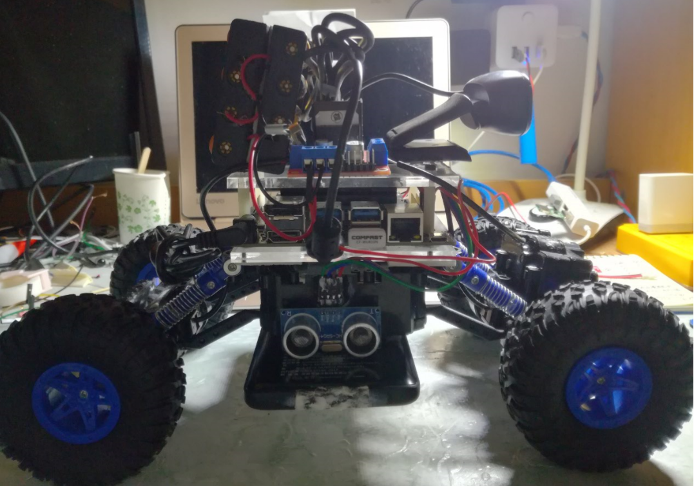
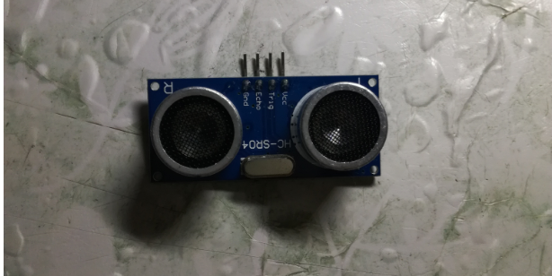
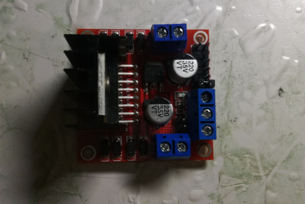
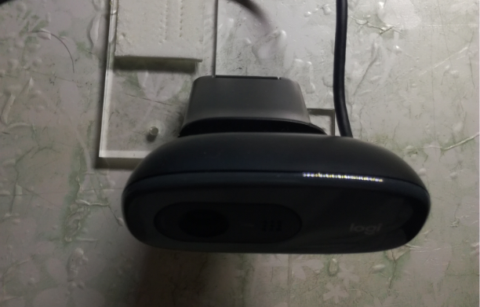

# Making a self-driving car with Jetson Nano
# 自动驾驶小车

# 超声波传感器 HC-SR04

# L298N模块-驱动直流电机

# 罗技-170摄像头

# 原理
**在detect.py中，使用了yolov3-tiny的目标检测模型，在Nano上测试可达10帧每秒，把图像三等分，只对中间的目标进行判断。另外左右各有一个超声波传感器检测左右边的距离，然后就是各种判断语句控制电机转向，因为Nano上没有PWM, 也可以再添加一个硬件用来调速。**
